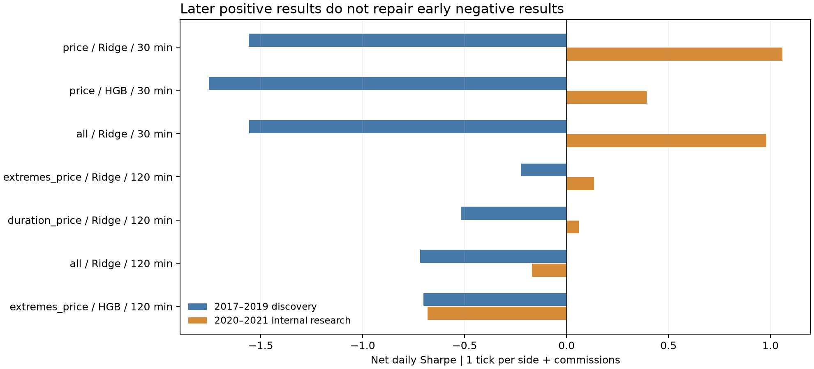
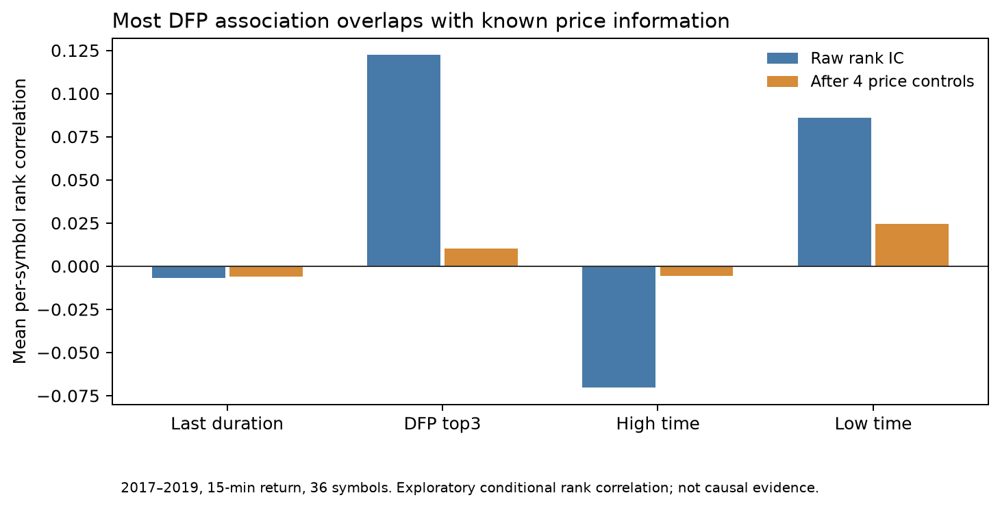

# 09:30 日内研究：有反转信息，尚未找到稳定覆盖成本的组合

本轮比较了 **102 个不同配置**：第一批 72 个，随后补充 30 个品种训练方式配置；第二批另重算了 3 个对照。按每次成交 1tick、历史开仓及平今手续费，**没有配置通过早段筛选**。这只涉及 09:30 单次决策，不代表其他盘中时点或所有日内策略无效。

## 当前判断

1. DFP 和极值时点有毛收益预测信息，但与价格位置、分钟均价偏离高度重叠。DFP 的 15 分钟平均品种 Spearman IC 为 0.122；与分钟均价偏离的秩相关为 −0.913。控制四项价格信息后，条件秩相关只剩 0.010。支持“当前 DFP 主要是价格反转代理”的解释，不能据此证明因果关系或完全排除非线性增量。
2. **价格＋极值时点＋Ridge** 比单纯价格组有局部改善，适合作为下一轮时间信息增量的主要对照；“全部时间因子一起加入”没有稳定优于这一小组合。Ridge 相比梯度提升树的净表现更稳，但仍不足以宣布可交易。
3. 更长持仓的毛表现有改善，却让预测值达到费用门槛的样本更多，所以交易次数和年度成本也上升。本框架每天最多一笔，120 分钟持仓并不自动降低换手。
4. 逐品种模型更活跃且更差。品种等权损失有局部改善，滚动窗口、季度重训、风险标准化目标未找到稳健盈利配置。复杂度提升尚未给出稳定增量。

## 统一交易及研究口径

2016 年提供初始训练；2017–2019 用于第一轮收敛；选定名单写盘后，才计算其 2020–2021 内部后段表现。第一批 72 个方案全部评估早段，仅 15 个进入后段。补充批在已看到第一批后段结果后提出，先评估 33 个早段配置，再对其中 9 个计算后段；**这一后段是再次使用的研究数据，不能称独立验证**。

固定 09:30 bar 结束时决策，下一根 09:31 标签 bar 的原始开盘价入场，09:45、10:00 或 11:30 的原始收盘价退出，分别持有 15、30、120 墙钟分钟（120 包含休市流逝时间）。每品种每天最多一笔，允许多、空、现金，无跨日仓位。此前夜盘分钟属于当前交易日的已知特征。

年度池由上一年数据确定，固定 1/N 名义份额，缺信号留现金。预测绝对值高于决策时估计的往返费用才交易；模型不使用未来实际手续费或入场/出场价格作为特征。主滑点为 **每边 1tick，往返 2ticks**；每边 0.5tick 只在原仓位不变时减少费用，不重新放宽交易门槛。

持续期阈值为严格过去 250 交易日分钟变化池的 55% 分位数；均衡价为前缀持续期最大的三个分钟价格均值。特征包括持续期、DFP、高低点时点，以及短期收益、价格位置、区间、分钟量加权收盘价代理、波动率、最近五分钟量占比。该均价不是逐笔成交 VWAP。

Ridge 固定 alpha=10；HGB 固定深度 3、100 次迭代、学习率 0.05，并关闭随机内部早停。训练数据日期在测试期之前，标签也必须在首次测试决策前结束；缺失填补、标准化仅训练拟合。比较扩展年窗、两年滚动年窗、季度重训及已知前缀风险尺度标准化目标。品种等权指训练损失中每个品种累计权重相同；预处理仍使用训练集观测。逐品种模型最少 200 个训练样本，混合/等权最少 1,000，逐品种早段可拟合样本覆盖约 85.9%，其余留现金。

## 十二条覆盖型复查清单

这是供后续复查的组合与模型对照，**不是十二条已合格的策略，也尚未冻结送 2022**。早段资格优先条件为至少两年净盈利、至少 300 笔、净 SR > 0；本轮合格数为零。程序为科学比较保留负结果、固定对照及未合格的相对靠前方案。编号用于配置索引，未按后段收益排序。

| 编号 | 因子与训练 | 2017–2019 净 SR | 2020–2021 净 SR | 2017–2021 净年化 |
|---|---|---:|---:|---:|
| C01 | 价格 / Ridge / 30m | -1.56 | 1.06 | -0.111% |
| C02 | 价格 / HGB / 30m | -1.75 | 0.39 | -0.452% |
| C03 | 价格＋全部时间 / Ridge / 30m | -1.56 | 0.98 | -0.067% |
| C04 | 仅时间 / Ridge / 30m | 0.03 | 0.22 | 0.016% |
| C05 | 价格＋极值时间 / Ridge / 120m | -0.22 | 0.13 | -0.020% |
| C06 | 价格 / Ridge / 120m | -0.34 | 0.08 | -0.131% |
| C07 | 价格＋持续期 / Ridge / 120m | -0.52 | 0.06 | -0.278% |
| C08 | 价格＋全部时间 / Ridge / 120m | -0.72 | -0.17 | -0.615% |
| C09 | 价格＋极值时间 / HGB / 120m | -0.70 | -0.68 | -1.078% |
| C10 | 仅时间 / Ridge / 15m | -0.12 | -0.40 | -0.077% |
| C11 | 价格＋极值时间 / 等权损失 Ridge / 120m | -0.08 | 0.10 | 0.023% |
| C12 | 仅时间 / 等权损失 Ridge / 30m | -0.01 | 0.36 | 0.026% |

C04 早段只有 19 笔交易、正盈利集中于一个品种，不能把其略正的 SR 当成稳健证据。C11、C12 完整研究期净年化约 0.02%–0.03%，接近零；少量正值不足以支持最终策略。

## 时间信息的增量

条件秩相关的计算：逐品种在 2017–2019 内将因子、未来收益及控制变量转为分位秩；用截距和 `ret_5`、`ret_15`、`close_location`、`close_vwap_proxy_dev` 分别回归因子秩与收益秩，再相关两个残差，最后对 36 个符合观测要求的品种等权平均。**这是事后的统计诊断，未用作交易特征或全期预处理。**

| 时间量 | 15m 原始 IC | 控制价格后 | 30m 控制后 | 120m 控制后 |
|---|---:|---:|---:|---:|
| 持续期长度 | -0.0068 | -0.0061 | -0.0083 | -0.0005 |
| DFP top3 | 0.1225 | 0.0103 | 0.0151 | 0.0236 |
| 高点时点 | -0.0704 | -0.0057 | -0.0077 | -0.0189 |
| 低点时点 | 0.0858 | 0.0244 | 0.0285 | 0.0210 |

持续期中位数为 1bar，约 87.5% 的样本不超过 2bars，其长度本身信息弱；时间类缺失约 0.10%，不是这轮失败的主要原因。低点时点保留一些条件相关性，因此优先研究“价格位置相似时，极值出现顺序/停留结构是否不同”，比继续重复叠加价格偏离代理更有依据。

## 成本、稳定性与训练建议

价格组 Ridge / 30m 在 2020–2021 净 SR 为 1.06，净年化约 0.64%；在 2017–2019 净 SR 为 −1.56，完整 2017–2021 净年化为 −0.11%。对其后段日收益做固定 20 交易日移动块自助法（2,000 次、seed=421），算术年化均值 95% 区间约 **−0.21% 至 1.91%**。该区间未对多重试验选择作校正，是探索性诊断，不能证明收益过程平稳或模型有稳定预测能力。

价格＋极值时点 Ridge / 120m 在完整期的年度手续费约 0.50%、tick 成本约 1.73%；品种等权版本分别约 0.46%、1.54%。成本拆分用固定仓位和两种 tick 费率，手续费 = 2×半 tick 总成本 − 全 tick 总成本。较低滑点可改善结果，但本轮主口径按用户确认维持每边 1tick。

后续继续使用混合品种 Ridge 作为基准，品种等权损失作为辅助对照；围绕价格、极值时点形成小特征组。优先重新构造与价格位置区别更清楚的时间结构、按因子机制设置决策时点和预测目标，再判断是否需要更复杂模型。当前不宜因为后段局部转好就选择高杠杆、翻转因子方向或冻结进入 2022。

## 留痕及边界

- 第一批：[完整运行](../runs/20261003_235943_233671_intraday_comparison/)、[早段成绩](../runs/20261003_235943_233671_intraday_comparison/discovery.csv)、[后段成绩](../runs/20261003_235943_233671_intraday_comparison/confirmation.csv)。
- 补充批：[运行与事前范围说明](../runs/20261004_001006_380510_intraday_comparison/)、`scope_protocol.json` 记录后段已被使用。
- 十二条定义：[配置](../config/intraday_candidates_20261004.json)；[完整期、费用、区间表](../runs/20261003_235943_233671_intraday_comparison/comparison_12.csv)；[诊断计算源码](../runs/20261003_235943_233671_intraday_comparison/analysis.py)。运行含准备数据、每折边界、逐笔预测、每日净收益、源文件哈希和库版本；结果数据因体积只保存在本地。
- 首次执行在成绩汇总处暴露变量作用域错误，修正并新增入口回归测试后，复用哈希验证不变的准备数据重新执行；恢复脚本与元数据随运行保存。后续增加训练范围和更严格的日期守卫，已验证实际折的训练掩码不变。
- 当前 143 项合成测试和真实数据训练/汇总复核用于实现验证；最终代码重算混合 Ridge、HGB、价格＋极值 Ridge、品种等权和逐品种五类代表配置，逐笔预测、仓位及每日损益均与保存结果一致，复现脚本保存在第一批运行的 `final_reproduce.py`。pandas/NumPy 有 4 条已知测试夹具拼接弃用提示。内部研究筛选涉及多重比较，IC、SR 和自助区间均是探索性证据，不宣称样本外显著性。
- **没有运行 2022；没有读取 2023–2025 真实行情或绩效。2022 历史上已被旧流程使用过**，其使用事实仍保留。
- 手续费历史、主力序列和 tick 输入沿用现有缓存；未新增交易所级历史发布时点核验。分钟价＋固定滑点是研究模型，没有涨跌停/排队/保证金与实际盘口冲击模拟。

时序训练方法依据：[scikit-learn 时间序列分折](https://scikit-learn.org/stable/modules/generated/sklearn.model_selection.TimeSeriesSplit.html)；HGB 固定训练与早停设置依据：[官方模型说明](https://scikit-learn.org/stable/modules/generated/sklearn.ensemble.HistGradientBoostingRegressor.html)。经济机制参照 `docs/20260609-兴业证券-基于高频时间维度的国债期货择时因子及个股CTA研究.pdf`，本轮的前缀因子是盘中扩展。
